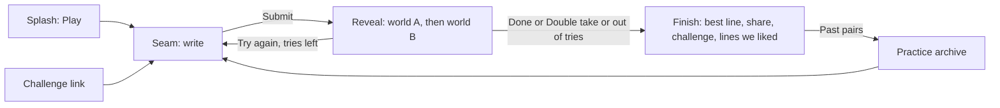

# Double Take, reimagined

Exploration record for a from-first-principles redesign. Nothing here changes the
live product. The recommended direction is `synthesis/index.html`, a **group game**
(see §9, which supersedes the solo recommendation in §6 to §8); the build spec is
[`DESIGN.md`](DESIGN.md). Finalists, the solo synthesis (`finalists/solo-daily.html`),
and rejected concepts stay here as lineage.

Every line in play is scored by **live Jev**. `serve.ts` serves this directory and
answers `/judge` with the production adjudication (`convex/judge.ts`, the authored
pair from `convex/content.ts`); the key never reaches the browser. There is no offline
scorer: without the server, lines are not scored. The `#state=` preview screens use
authored example levels (`DT.fixture`) and never call the judge.

```sh
JEV_MODEL=typesafe/jev-1.13 \
JEV_DECISIONS_URL=https://openrouter.ai/api/alpha/decisions \
pass-env run -e OPENROUTER_API_KEY=workstation/DOUBLETAKE_OPENROUTER_API_KEY -- \
bun design/reimagine/serve.ts
# http://127.0.0.1:4173/synthesis/   http://127.0.0.1:4173/finalists/seam.html
```

## 1. Brief

**Job.** Write one sentence that belongs in two very different worlds, then watch the
same words turn into something else. Everything the player does serves that moment:
the double take.

**Audience.** Originally assumed to be solo daily puzzle players. Corrected by the
operator on 2026-09-23: groups of friends playing together, Apples to Apples style (§9).

**Why now.** The operator's read: the core concept is strong; the design, aesthetic,
and mechanics get in its way.

### What is in the way (diagnosis of `components/double-take.tsx`, `app/globals.css`)

| Problem | Evidence | Effect |
| --- | --- | --- |
| Three vocabularies at once | Print shop (`Print my line`, `Setting the press`, `MISREGISTERED ON PURPOSE`, impressions), card table (`Open a table`, `Take my seat`, `Leave table`), and judging (`Natural`, `Strained`, points) | The player learns metaphors instead of the game. |
| Reading load before writing | Pair title, pill, two labels, two setting sentences, `01`/`02` markers, hint, counter | The prompt is ~60 words; the answer may be 12. |
| Opaque scoring | Four hidden judge questions, three gates, a nonlinear 0/1/3/6 table, level names plus points plus gate note | Players cannot form a model of what "good" is, so they cannot improve. |
| The flip is a button | `Second impression` swaps text inside a card beside `Another line`, `New pair`, `Sound: on` | The signature moment has the same weight as a settings toggle. |
| Party machinery carries the game | Rooms, host, seats, heartbeats, late-joiner spectators, 150 s timer, three revisions, `Reveal now (host)`, host transfer | Most code and most UI serve coordination, and a 1 to 12 s judge call sits in the middle of a live group's pacing. |
| No ritual, no artifact | Solo is endless; nothing to return to, nothing to share | Nothing pulls a player back or spreads the game. |
| Decorative noise | Scanline texture, two radial gradient washes, plum paper, offset box shadows, pills, kickers | Competes with the one thing that matters: the sentence. |

### What is strong (keep)

1. **One sentence, two worlds.** The creative act is legible in one breath.
2. **The weaker reading wins.** The best rule in the game: it forbids nailing one side
   and makes every line a balancing act. It should be *felt*, not explained.
3. **Stitching is illegal.** The one anti-cheese rule players need, and it is teachable.
4. **The server-owned judge** with authored contexts and code-composed results
   (`convex/rules.ts`), which makes solo play and a daily puzzle possible at all.
5. **Two colors for two readings** from Two Impressions: the right instinct, wrong
   execution (riso misregistration reads as a glitch, not a double take).

### Locked requirements (from repo, not guessed)

- Sentence: one line, at most 12 words, 160 chars (`convex/rules.ts`).
- Result composition stays in code: stitched and generic gates first, then the weaker
  side. Four plausibility levels (`convex/rubrics.ts`).
- Never show model names, confidence, rubric/schema versions, gates by name, or provider
  errors to players (`docs/design-and-copy.md`).
- Player copy passes `design-check` (no dash punctuation, no engineering vocabulary).
- Phone first; accountless.

### Assumptions (brief is silent; recorded, not locked)

- A daily shared pair is acceptable content cadence (10 authored pairs exist; a daily
  needs ~one new pair per day or a rotation).
- Showing other people's lines requires editorial curation or moderation; unmoderated
  public UGC is out of scope.
- Parlor rooms are negotiable ("everything is on the table").

## 2. Reference study (principles, not pixels)

Principles below are from long familiarity with the products; not re-surveyed today
(2026-09-23).

| Reference | Principle extracted | Where it applies | Limit |
| --- | --- | --- | --- |
| Wordle (nytimes.com/games/wordle) | One puzzle a day for everyone; a small try budget with legible per-try feedback; a spoiler-free emoji share grid; the tile flip is the only animation that matters | Daily cadence, three tries, share text, one signature motion | Wordle's feedback is exact; ours is a judgment, so feedback must stay coarse (three pips, not decimals) |
| Spelling Bee | Named ranks as encouragement ("Solid", "Genius") instead of numbers | Result words instead of points | Bee ranks are cumulative; ours are per line |
| Connections | Colors carry meaning; a near miss is named ("One away") | Name the weak world ("The villain's side is the weak one") | |
| NYT Games splash screens | Mark, name, one sentence, one primary button, date and number; nothing else | Entry screen | |
| Quiplash (Jackbox) | Delight comes from humans reading other humans' lines | Duel and gallery: reading other lines is the payoff after writing | Needs a shared screen and a live group; we do not |

## 3. IA and journeys

Current: `Entrance → (Practice | Open table | Join table) → Room lobby → Round (write, wait, reveal, next) × 3 → Final scores`. Five screens of coordination before the first double take in multiplayer.

Recommended (synthesis):



One screen to write, one moment to reveal, one screen to finish. No lobby, no host,
no timer.

## 4. Concepts

Six named concepts. Range: conservative, evolutionary, radical, plus one labeled wildcard.

| # | Name | Range | Archetype | Divergence claim |
| --- | --- | --- | --- | --- |
| 1 | Quiet Table | Conservative | operate | Keeps rooms and solo; differs from today only by stripping the print metaphor, cutting copy, and staging the flip. |
| 2 | Daily Grid | Evolutionary | decide/learn | One shared pair a day with three tries; the try history grid is the stage (Wordle rows). |
| 3 | Seam | Radical (spatial) | explore | Space is the mechanic: the screen is split into the two worlds and you write on the border; the reveal floods one world then the other across a sentence that never moves. |
| 4 | Duel | Radical (social) | compare | The unit of play is two players: send a line, a friend answers the same pair blind, both lines flip between worlds together. Replaces rooms entirely. |
| 5 | Living Room | Radical (party) | operate/perform | One shared screen shows the pair and the reveal; phones write; people, not the judge, vote which lines landed both ways. |
| 6 | Overheard *(wildcard)* | Out of family | decide/learn | Inverts the verb: you are shown a line and pick the two worlds it came from out of eight tiles (Connections shape). Player lines become puzzles for readers. |

Dimension spread:

| Dimension | Quiet Table | Daily Grid | Seam | Duel | Living Room | Overheard |
| --- | --- | --- | --- | --- | --- | --- |
| Primary job | play with a group | solve today's pair | play with language | beat a friend | perform for a room | read and deduce |
| Content model | rooms and rounds | date-keyed puzzle | endless pairs | two-person thread | live session | tile set per line |
| Layout | stacked cards | swatches, input, grid | split viewport, seam input | bands, then twin cards | TV plus phone controller | 4x2 tile grid |
| Hierarchy | even | grid dominant | sentence dominant | comparison dominant | stage dominant | tiles dominant |
| Typography | sans | one grotesk (Libre Franklin) | text serif line (Newsreader) | grotesk plus serif (Figtree, Source Serif 4) | display sans for distance | sans |
| Palette | neutral dark | white; color only in pips | world colors flood the viewport | white; color on bands and cards | dark stage | world colored tiles |
| Motion | card flip | tile flip per row | clip-path flood, still sentence | synchronized twin flip | theatrical reveal | tile select, group snap |
| Organized by | phase | try | pair | person | player | line |

## 5. Comparative critique (against the job: write one line, feel the double take)

### Quiet Table — rejected
- Optimizes: lowest migration cost; keeps every current capability.
- Sacrifices: the party machinery stays the center of gravity; the judge's latency still sits inside a live group's turn.
- Wins for: an existing group that already plays in rooms.
- Fails when: a new player arrives alone, which is the common case for a phone word game.
- Keep: nothing structural. The copy cuts carry into every other concept.

### Daily Grid — merges (spine: cadence, tries, share)
- Optimizes: ritual and spread. Three tries turn a one-shot judgment into a puzzle you can learn from: the weak side is named, you revise, the grid records the climb.
- Sacrifices: the sentence becomes small type in a row; the double take is reduced to pips flipping. It is Wordle's moment, not ours.
- Wins for: the daily habit player.
- Fails when: the reveal is the reason to play; a grid cannot carry meaning change.
- Keep: daily shared pair, three tries with best counting, spoiler-free share grid, result words (Spelling Bee), naming the weak world.

### Seam — merges (spine: the writing surface and the reveal)
- Optimizes: the moment. Writing on the border between two worlds explains the game without words; the flood reveal with a pixel-still sentence *is* a double take: the words do not change, the world does.
- Sacrifices: no ritual and nothing to share; endless practice has no stakes.
- Wins for: first contact. A new player understands the game from the layout alone.
- Fails when: dark worlds and light worlds meet on a small phone and the seam band competes with both; needs careful color authoring per pair.
- Keep: the split-world writing surface, the flood reveal with two stacked layers and a clip-path wipe, tap to flip after the reveal, the weak world named in one sentence.

### Duel — merges (the social layer)
- Optimizes: human delight without live coordination. A link is the whole multiplayer system: no rooms, hosts, seats, heartbeats, or timers.
- Sacrifices: no simultaneous group play; two players at a time.
- Wins for: the group chat, which is where daily games spread.
- Fails when: links need server storage and anti-abuse for the sender's hidden line; that is real (small) backend work.
- Keep: "Challenge a friend" on the finish screen; the friend plays the same pair blind; the synchronized twin flip on their finish.

### Living Room — rejected for now
- Optimizes: the purest party energy: a room laughing at a line flipping.
- Sacrifices: needs a shared screen, a group, and a host; judge latency and human voting both slow the loop. It is the most machinery of any concept, which is the problem we are removing.
- Wins for: a party that already has a TV on.
- Fails when: fewer than four people, or no shared screen.
- Keep: the idea that people reading people is the payoff. Revisit later as a mode built on the daily pair, only after the solo loop proves out.

### Overheard — rejected as primary, recorded as a future companion
- Optimizes: lowest creative barrier (reading, not writing); creates a flywheel where good player lines become puzzles.
- Sacrifices: abandons the core verb. It is a different game.
- Wins for: players who freeze at a blank field.
- Fails when: there is no curated line supply yet.
- Keep: the gallery idea. Showing a few curated lines after you finish is the first, cheap step toward it.

## 6. Synthesis: One Line

- **Spine:** Seam's writing surface and reveal carry the moment; Daily Grid's cadence carries the ritual.
- **Grafts:**
  - Daily shared pair, three tries, best counts, share grid, result words (from Daily Grid) fix Seam's lack of stakes and spread.
  - Named weak world after each try (from Connections via Daily Grid) turns an opaque judgment into a revision hint.
  - Challenge a friend with a blind answer and twin flip (from Duel) replaces rooms.
  - "Lines we liked", three curated lines you can flip (from Overheard and Living Room) is the reading payoff after writing.
- **Dropped:** rooms, host, seats, timer, revisions UI, points, the print metaphor, setting flavor text (it stays judge-only), sound toggle, scanlines and gradients.

The finalists (`finalists/`) were built from the concept specs above by separate
builders; the synthesis was built alongside them and adjusted after reviewing their
rendered states (see §7).

## 7. Finalist review and grafts

Reviewed from rendered browser screenshots at 390x844 (all three) and 1280x800
(synthesis) on 2026-09-23.

| Finalist | What the render showed | Verdict | Grafted into synthesis |
| --- | --- | --- | --- |
| `finalists/daily.html` | Clean and legible, but reads as a form: labeled input box, swatch tiles, a grid of rows. The sentence is 15 px type in a row and the double take only happens inside a detail modal. Confirms the critique: Wordle's moment, not ours. | Merges (cadence only) | Nothing new visually. The try budget stays as text ("Try 2 of 3") rather than empty rows. |
| `finalists/seam.html` | The split world writing surface works on first sight; large roman world labels make the worlds feel like places. The reveal keeps the sentence still. Weak spots: the empty field shows only an underline, the word meter wraps around the button, results show words without pips, and large labels at the top of the reveal compete with the sentence. | Spine | Larger world labels on the writing surface (now 30 to 44 px). Labels stay small in the reveal so the sentence wins. "The weaker reading" phrasing informed "is the weak side". |
| `finalists/duel.html` | The invitation screen is the warmest copy in the set ("Ada sent you a Double Take."). Stacked full width cards read better on a phone than side by side cards. Left aligned bold grotesk feels editorial, not playful. | Merges (social) | Invitation copy. Duel cards stack below 560 px and sit side by side above it. |

Refinement pass on the synthesis (before, then after, from the same review):

- Gated lines showed a per world fit ("Fits") under a "Miss" result. Now every gated
  side reads "Doesn't count" with empty pips, so the stage never contradicts the result.
- The judge wait had no visible cue beyond a dimmed label (which also failed contrast
  mid-animation). Now three empty pips breathe where the verdict will land; the label
  stays at full contrast.
- The flip hint sat under the result sheet. It now lives under each world's verdict.
- The result sheet was nested inside the flip button (nested interactive controls).
  It is now a sibling region, inert until it opens.
- A later `transition` rule silently disabled the clip-path wipe. Fixed; the wipe was
  sampled mid-flight (`inset(28.6% 0 0 0)`) with the sentence's y position identical in
  both layers throughout.
- Focus rings were invisible on the black primary button and on dark worlds. Rings
  now use the page ink on buttons and the world's ink on the stage.

## 8. Evidence (solo synthesis, now `finalists/solo-daily.html`)

Browser screenshots, not generated images. Stored outside Git in
`~/.cache/tmp/dt-reimagine-qa/` with `manifest.json` (21 named states at 390x844 and
1280x800; finish states full page). Checks run on 2026-09-23:

- Full real flow, no hash seeding: failed submit keeps the text and does not use a
  try; generic, retry hint and prefill, Lands, Double take; three rows on finish; saved
  play survives reload ("See today's result"); share text built from the stored tries.
- axe-core 4.10.2 on all 21 synthesis states: no violations.
- Contrast: every world `bg`/`ink` pair is 14.6:1 or better; secondary ink 7.0:1;
  placeholder 4.54:1.
- Reduced motion: the whole reveal completes with crossfades; Space flips the stage.
- `design-check` on all prototypes: three findings, all the word "cookie" in the
  fortune cookie pair (one label, one pair key, one judge stem). Reviewed as false
  positives: it is the world's name, not browser vocabulary.

Not verified: real Jev judgments on the new flow (the judge here is simulated), iOS
Safari keyboard behavior on the seam, and real share sheets. The mark was rendered at
16 and 32 px on white, black, light tab, and dark tab backgrounds: at 16 px the inner
black line blurs to a smudge and the navy half loses its edge on black. A 16 px optical
variant (no inner line, wider white band, stronger outline) is required before launch;
see `DESIGN.md`.

## 9. Direction change: a group game (operator, 2026-09-23)

> "This shouldn't be a solo game... almost like an apples to apples. Everyone in the group
> gets the same two pieces of context and everyone has to write something that fits
> equally in both. Jev then grades how much each line fits with both and the winner is
> whoever got max points across both pieces of context."

What changed against the solo synthesis:

| Solo synthesis (§6) | Group synthesis (now) | Why |
| --- | --- | --- |
| Daily pair, three tries, best counts | Rooms of 3 to 8, three rounds, one line per round | Operator's call; one line per round is the Apples to Apples card |
| Result is the weaker world | Points are both worlds added (0 to 6); 0 if stitched, generic, or either world rejects it; ties go to the more balanced line | "Max points across both", while the zero floor keeps "fits equally in both" true: without it, 3 + 0 beats 1 + 1 |
| Share grid, challenge link, curated gallery | Anonymous reveal to the whole room, lowest to highest, names last | The group is the audience; guessing who wrote which is the social payoff |
| No clock | No clock until all but one are in, then 30 seconds for the last player | Nobody holds the table, nobody writes under a timer by default |
| Judge when submitted, reveal immediately | Judge when locked in, hidden until everyone is in | Judge latency never shows in front of the group |

Kept from the solo work: the seam writing surface, the still line wipe between worlds,
per world pips and words, world colors as the only palette, the type, the copy rules, and
the anti-noise cuts. The Quiet Table and Living Room critiques (§5) called rooms the
problem; the real problem was what rooms carried (print metaphor, timer, revisions, host
force reveal, a flat results list). The existing Parlor rooms and `convex/game.ts` round
machine stay; see `DESIGN.md` implementation mapping.

### Group evidence (2026-09-23)

Browser screenshots in `~/.cache/tmp/dt-reimagine-qa/group/` with `manifest.json`: 23
named states at 390x844 and 1280x800.

- Real flow, no hash seeding: start, name, lobby (players arrive; Start the game enables at
  3), lock in with a forced judge failure (error shown, text kept, line not locked), lock in
  again, last player clock on a tablemate ("Waiting on Sam. 30 seconds."), reveal of three
  lines lowest to highest ("1 + 3 points / Sam", "3 + 2 points / You", "3 + 3 points / Double
  take / Priya") at about 5.4 s each, round result and standings, then round 2 with you as
  the last player ("You're the last one. 30 seconds.") and the reveal starting as you lock in.
- axe-core 4.10.2 on all 23 states: no violations (after giving the lobby a heading).
- `design-check`: only the known "cookie" false positives in `shared/game.js`.

Not verified: synchronized reveal across real phones (the prototype runs one clock),
host transfer and late joiners in the new styling.

Live Jev (2026-09-23): a full four player round through `serve.ts`, every line judged
by `typesafe/jev-1.13` in 185 to 386 ms. Jev did not always agree with the authored
example levels (Priya's line scored 2 + 3, not 3 + 3), which is why authored levels are
now preview fixtures only.
